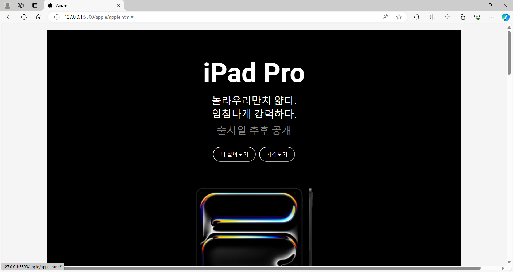
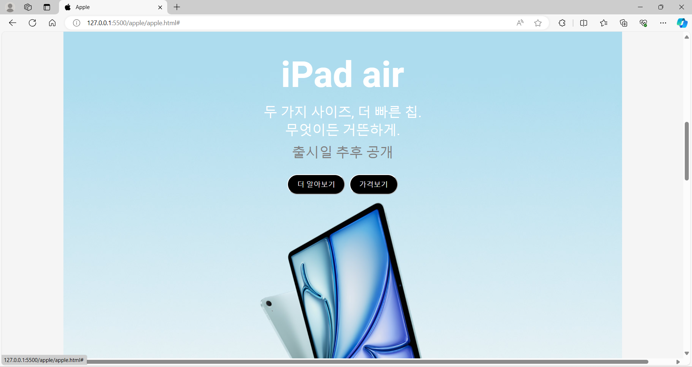
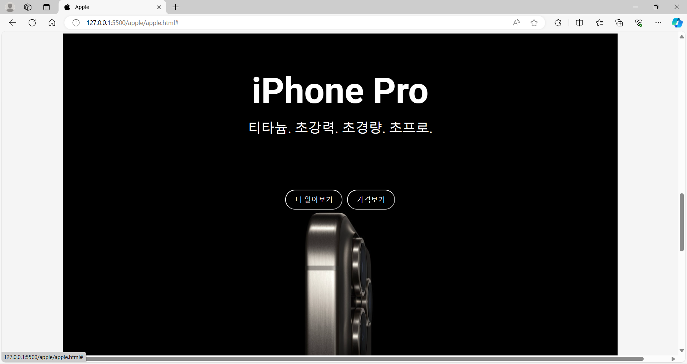
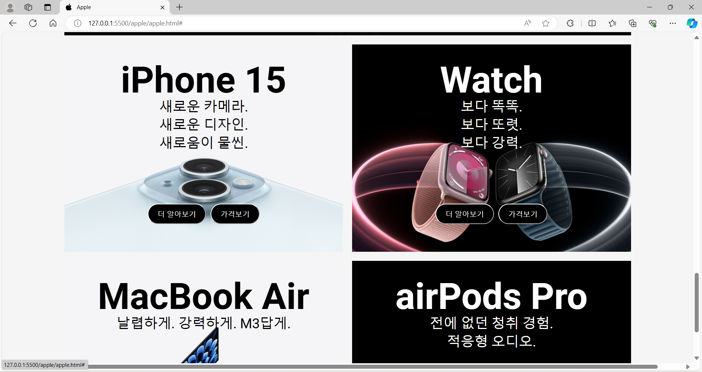
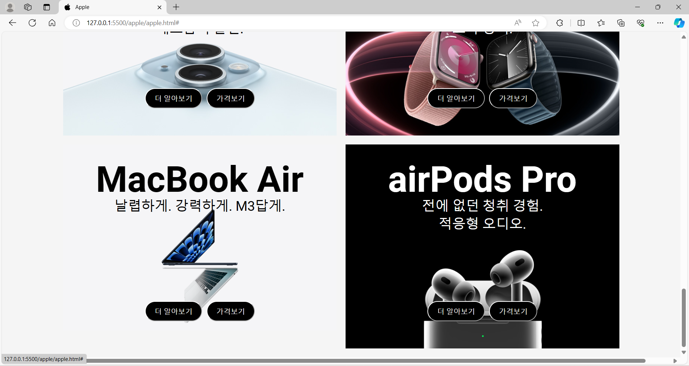
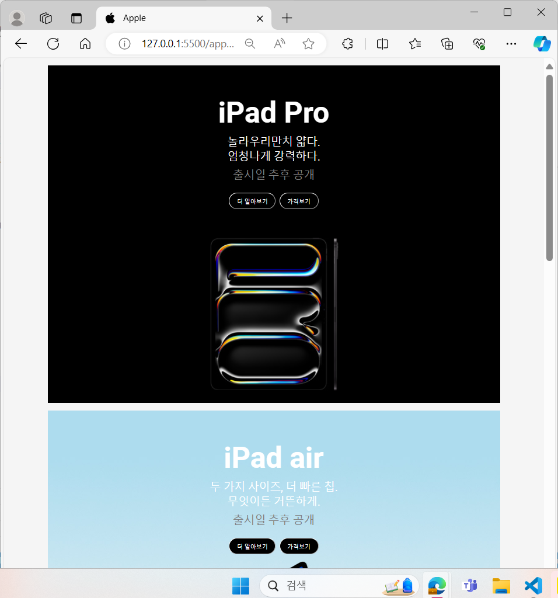

# apple 제품 카드








🫥 [아쉬운점]

1. 버튼을 완벽하게 배치를 못하였다.
2. 글씨를 조정을 못하였다.
3. 시간 상의 이유로 움직이는 이미지를 제작하지 못하였습니다.

🚩[구조]
1. 최상위 div 요소를 ```container```로 감쌌고, container에는 ```display: grid;``` 를 주어 grid로 레이아웃 배치하였습니다.
2. 이미지는 ```position: relative;```으로 하고, 이미지는 ```position: absolute;```를 설정하여 사진 위에 텍스트가 고정적으로 배치되게 하였습니다.
3. ```  @media screen and (max-width: 1024px) ``` 화면 창이 작아졌을 때 사진이 큰 것들을 ```display: none```하여 보이지 않게 하였습니다.
