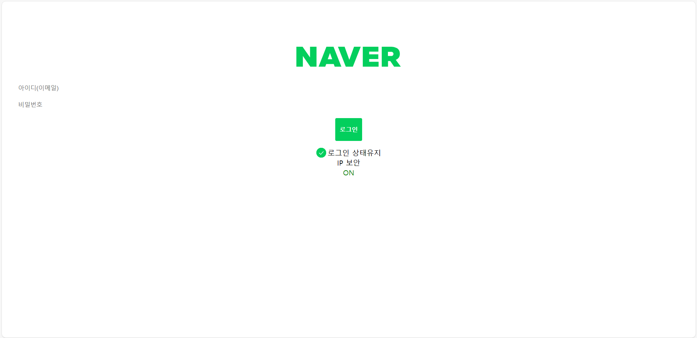
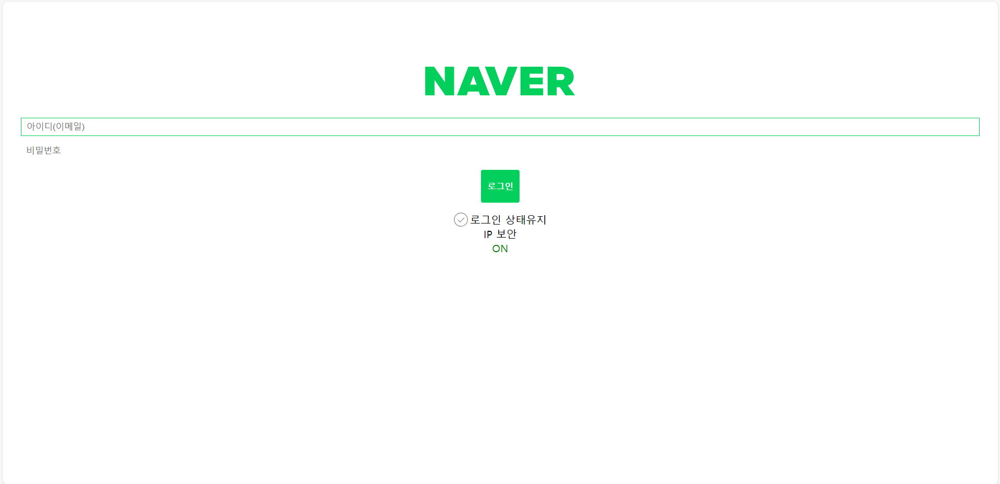
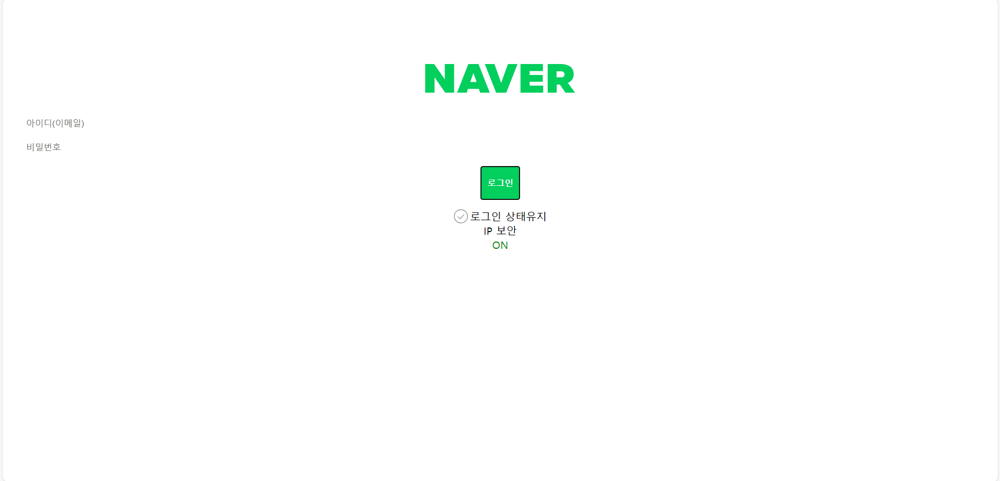

### 시간 부족으로 인한 미완성
#### 🤔해결해야하는 부분
1. 아이디, 로그인 창 가운데 정렬
2. 버튼 크기 조정
3. 로그인 상태 유지, IP보안, ON/OFF 한줄로 정렬
4. IP 보안을 클릭하면 사진 페이지로 넘어가는 기능
5. IP보안과 ON/OFF는 키보드 TAB으로 박스가 나타나지 않음

 
 
 

#### 이번 과제 후기 
😅다음 과제는 시간적 여유를 갖고 완성도를 높여야 겠다.
